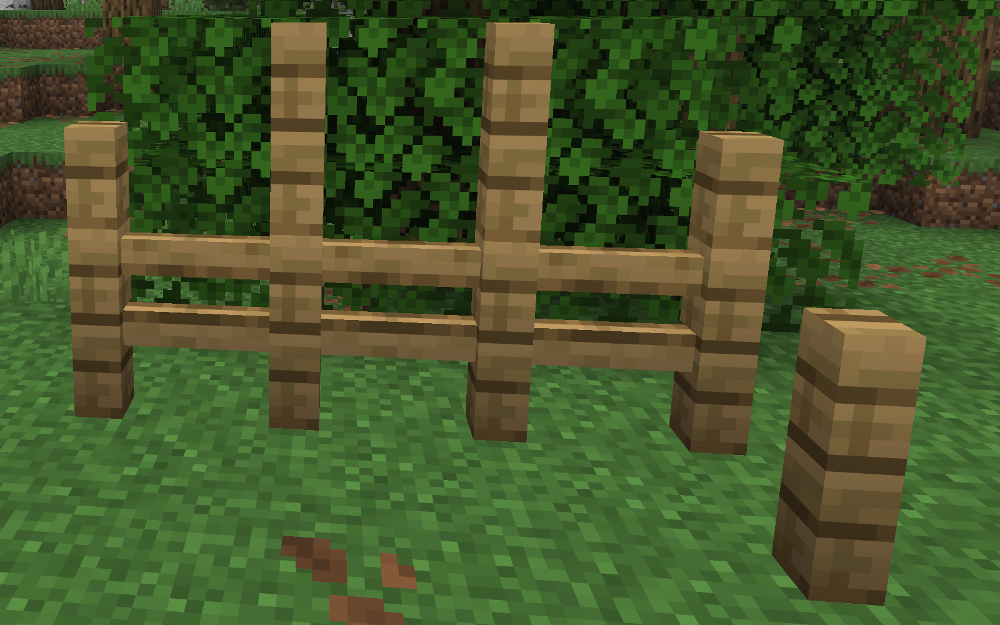
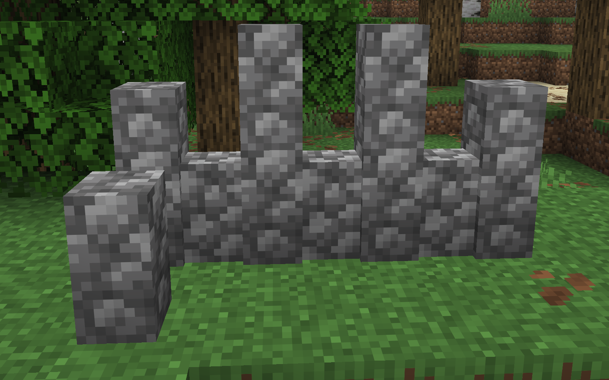
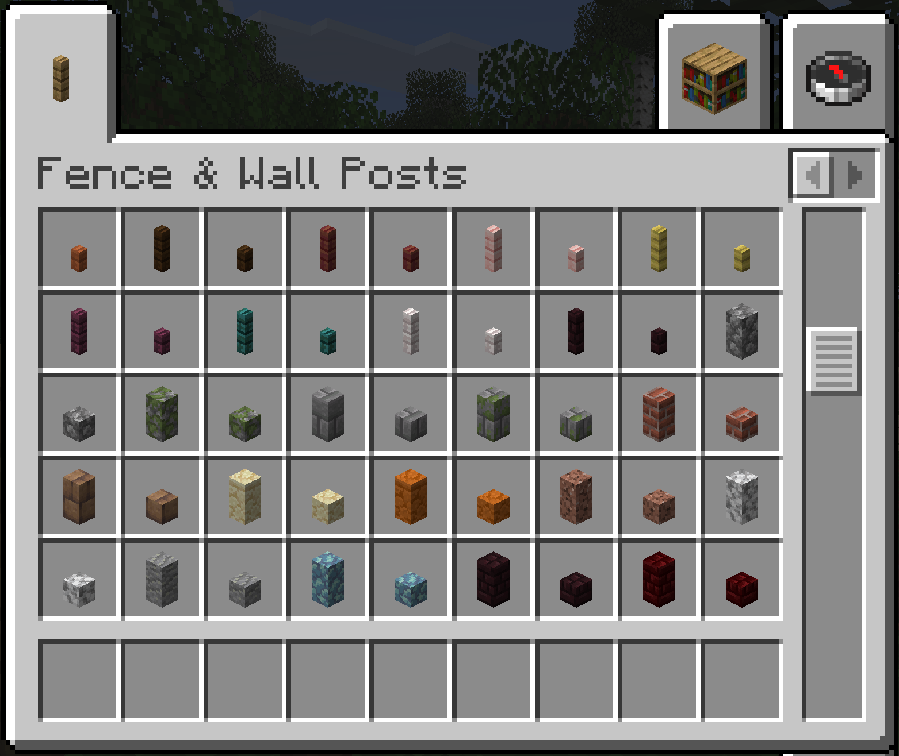

# Fence Posts

A Minecraft Fabric mod that adds standalone fence and wall posts with half-height slab variants.

## Screenshots

| Fence Posts | Wall Posts |
|:-----------:|:----------:|
|  |  |



## Features

- **Fence Posts** - Standalone 4x4 pixel posts for all vanilla fence types (13 variants)
- **Wall Posts** - Standalone 8x8 pixel posts for all vanilla wall types (25 variants)
- **Slab Variants** - Half-height versions of all posts that can be stacked
- **Waterlogging** - All posts support waterlogging
- **Lead Attachment** - Fence posts support attaching leads (just like vanilla fences)
- **Creative Tab** - Dedicated "Fence & Wall Posts" creative tab

## Supported Blocks

### Fence Posts
Oak, Spruce, Birch, Jungle, Acacia, Dark Oak, Mangrove, Cherry, Bamboo, Crimson, Warped, Pale Oak, Nether Brick

### Wall Posts
Cobblestone, Mossy Cobblestone, Stone Brick, Mossy Stone Brick, Brick, Mud Brick, Sandstone, Red Sandstone, Granite, Diorite, Andesite, Prismarine, Nether Brick, Red Nether Brick, End Stone Brick, Blackstone, Polished Blackstone, Polished Blackstone Brick, Cobbled Deepslate, Polished Deepslate, Deepslate Brick, Deepslate Tile, Tuff, Polished Tuff, Tuff Brick

## Crafting

- **1 Fence → 2 Fence Posts**
- **1 Wall → 2 Wall Posts**
- **1 Post → 2 Post Slabs**

## Requirements

- Minecraft 1.21+
- Fabric Loader 0.18.1+
- Fabric API

## Installation

1. Install [Fabric Loader](https://fabricmc.net/use/)
2. Install [Fabric API](https://modrinth.com/mod/fabric-api)
3. Download the mod JAR and place it in your `mods` folder

## For Mod Developers

This mod provides a public API for adding fence/wall post support for custom blocks:

```java
import justfatlard.fence_posts.Main;
import net.minecraft.sound.BlockSoundGroup;

// Register a custom fence post
Main.registerFencePost("mymod_custom", BlockSoundGroup.WOOD, true);

// Register a custom wall post
Main.registerWallPost("mymod_custom", BlockSoundGroup.STONE);
```

Note: You'll need to provide your own resource files (models, blockstates, textures, recipes, loot tables) for custom posts. See the `RuntimeResourceGenerator` class for helper methods to generate these programmatically.

## Building from Source

```bash
./gradlew build
```

The built JAR will be in `build/libs/`.

## License

MIT License - see [LICENSE](LICENSE) for details.
